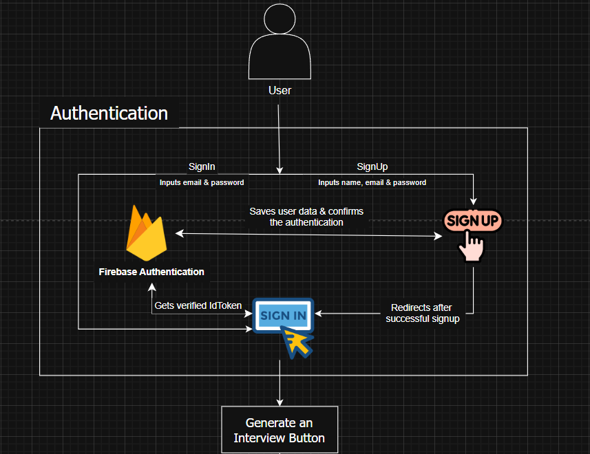
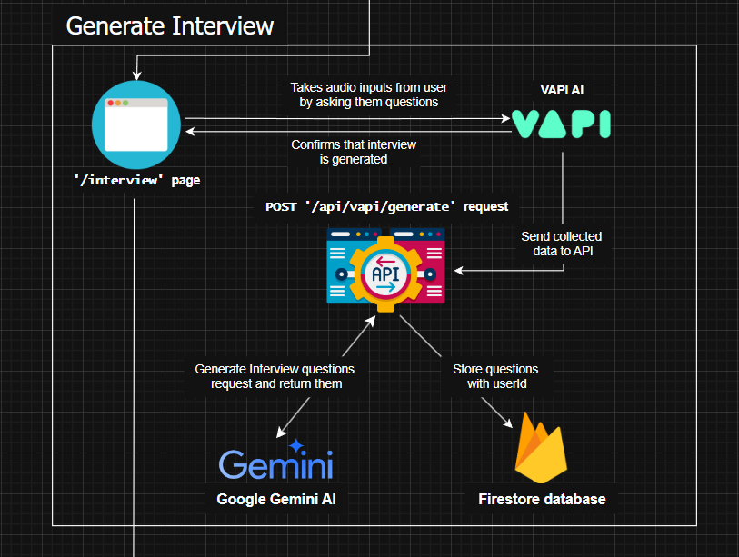
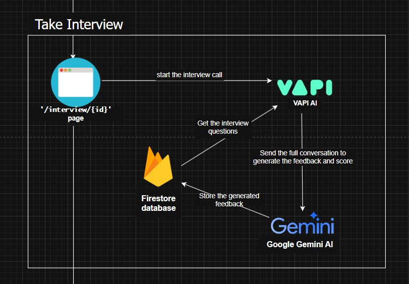
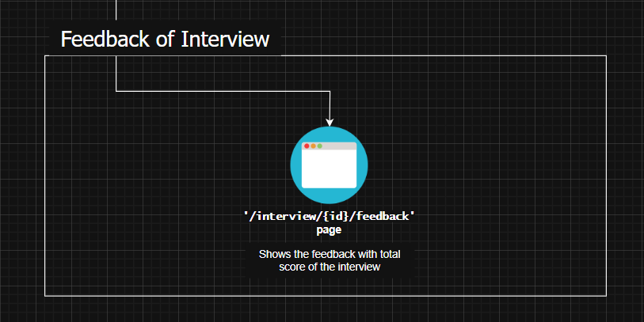

<div align="center">
  
  <h1>InterVueAI</h1>
  <p><strong>AI-Powered Technical Interview Practice Platform</strong></p>
</div>

## Table of Contents

1. 🚀 [Overview](#overview)
2. 🛠️ [Tech Stack](#tech-stack)
3. ✨ [Features](#features)
4. 📁 [Project Structure](#project-structure)
5. 🤸 [Quick Start](#quick-start)
6. 📐 [Sequence Diagram](#sequence)
7. 📜 [Scripts](#scripts)

<hr />

## <a name="overview">🚀 Overview</a>

InterVueAI is an AI-powered platform for practicing mock interviews and receiving instant feedback. Built with Next.js, React, TypeScript, and Firebase, it provides a modern, interactive experience for users to prepare for technical interviews.

## <a name="tech-stack">🛠️ Tech Stack</a>

- **Frontend:** [Next.js](https://nextjs.org/), [React](https://reactjs.org/), [TypeScript](https://www.typescriptlang.org/), [Tailwind CSS](https://tailwindcss.com/)
- **Backend:** [Firebase](https://firebase.google.com/) (Auth, Firestore)
- **UI Components:** [shadcn/ui](https://ui.shadcn.com/)

## <a name="features">✨ Features</a>

- **🤖 AI-Powered Mock Interviews:** Practice interviews for various roles and tech stacks
- **💬 Real-time Conversation:** Natural dialogue with AI interviewer using voice interactions
- **📊 Detailed Feedback:** Get comprehensive scores and assessments after each interview
- **🧩 Tech Stack Icons:** Visual representation of technologies involved in each interview
- **🔐 Authentication:** Secure user authentication system
- **📱 Responsive UI:** Styled with Tailwind CSS and custom gradients for a modern look
- **🔥 Firebase Integration:** User authentication and data storage

## <a name="project-structure">📁 Project Structure</a>

```
ai_interviewer_intervueai/
├── app/                # Next.js app directory
├── components/         # React components
├── constants/          # Static data
├── firebase/           # Firebase client and admin setup
├── lib/                # Utility functions
├── public/             # Static assets
├── types/              # TypeScript type definitions
├── .env.local          # Environment variables (not committed)
├── package.json        # Project dependencies and scripts
├── tailwind.config.js  # Tailwind CSS configuration
├── postcss.config.mjs  # PostCSS configuration
├── tsconfig.json       # TypeScript configuration
└── Readme.md           # Project documentation
```

## <a name="quick-start">🤸 Quick Start</a>

### Prerequisites
- Node.js (v18+ recommended)
- npm or Yarn
- Firebase account and project

### 1. Clone the Repository
```bash
git clone https://github.com/Antovex/InterVueAI.git
cd InterVueAI
```

### 2. Install Dependencies
```bash
npm install
# or
yarn install
```

### 3. Set Up Firebase
- Create a Firebase project at [Firebase Console](https://console.firebase.google.com/)
- Enable Authentication (Email/Password) and Firestore Database
- Create a web app in your Firebase project settings
- Generate Firebase Admin SDK service account credentials

### 4. Configure Environment Variables
Create a `.env.local` file in the root directory using `.env.example` file

### 5. Run Development Server
```bash
npm run dev
# or
yarn dev
```

### 6. Open Your Browser
Navigate to [http://localhost:3000](http://localhost:3000) to use the application

### 7. Create an Account
Sign up for a new account using the authentication form

### 8. Start Your First Interview
- Select an interview type
- Choose relevant tech stacks
- Begin your AI-powered mock interview session

### 9. View Feedback
Complete the interview to receive detailed feedback and performance metrics

## <a name="sequence">Sequence Diagram</a>
#### Full Sequence Diagram: [.png format](Sequence_diagram.drawio.png) | [draw.io file (should be opened in draw.io website)](Sequence_diagram.drawio)

<div align="center">
  
</div>
<div align="center">
  
</div>
<div align="center">
  
</div>
<div align="center">
  
</div>


## <a href="scripts">📜 Scripts</a>

- `dev` - Start the development server
- `build` - Build the application for production
- `start` - Start the production server
- `lint` - Run ESLint
- `lint:fix` - Run ESLint and fix issues

## Contributing

Pull requests are welcome! For major changes, please open an issue first to discuss what you would like to change.

## Acknowledgements

- [Next.js](https://nextjs.org/)
- [shadcn/ui](https://ui.shadcn.com/)
- [Firebase](https://firebase.google.com/)
